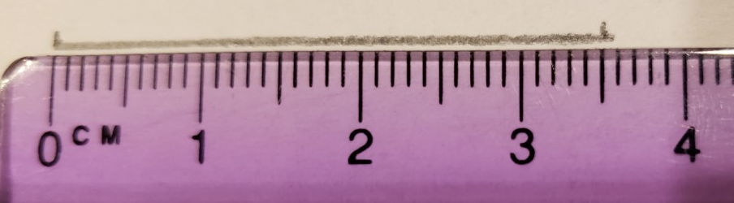
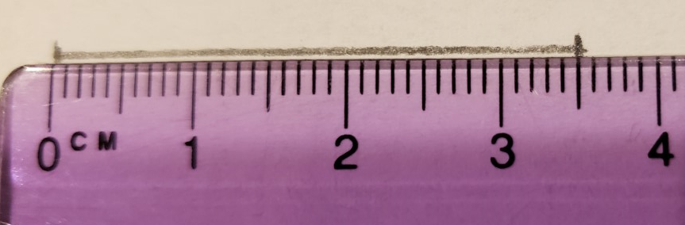

# Chapter 1 - Measuring, units, density
pages 1-35

## Week 0
- Thursday - Read Introduction, Pages 1-5
- Friday - Read pages 6-11 stop after CC
- [Links for chapter 1](https://bereanbuilders.com/ecomm/online-content/discovering-design-with-chemistry/ddc-chapter-1/)
  - [video on measuring](https://www.youtube.com/watch?v=7MzuinoHJg8)
  - [video on significant figures](https://youtu.be/mPAUD2mcHCM)

## Notes:
- Chemistry is the study of matter.
- `Matter` - Anything that has mass and takes up space.
- When measuring something, always estimate the distince between the marks. 
- Always include the units with your measurements.
- A digit (or figure) in a measurement is significant if it is not a zero. 
- A zero digit is significant if it is between non-zero digits or to the right of non-zero digits AND to the right of the decimal point.

## Examples:

### Measuring

In the picture above the line length is somewhere between 3.5 cm and 3.6 cm. In Since the ruler can easily show that the length is between these 2 values, we should include this information in the measurement we take. In other words, estimate the next decimal place. To me, it looks like about 3.53 cm (a third of the way from the 5 to 6). Writing the measurement as either 3.5 cm or 3.6 cm would be inaccurate.

In the picture above, the line length is exactly on the mark of 3.5 cm. However, in order to show that it is exactly on that mark we still need to show one additional decimal place. In other words, we would write this value as 3.50 cm. Writing this as 3.5 cm would be inaccurate.

So on this measuring device, we would always write the measurement as #.## cm which is always in hundredths of a centimeter. This is one additional decimal place than the device shows directly. The smallest marks on the ruler are tenths of a centimeter. But we can estimate the hundredths place and so we should.

### Significant figures
All of the following measurements have 4 significant figures:
- 1234 cm
- 1004 kg
- 0000001234000000 in
- 0000001004000000 g
- 00001.234 mm
- 00001.004 ml
- 00001.000 ft
- 0.0000001234 s
- 0.0000001004 dg
- 0.0000001000 ms

