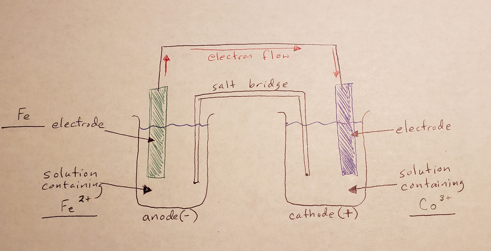
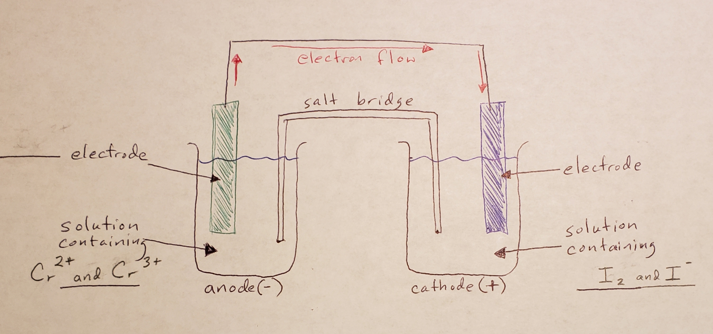

# Chapter 12:  Redox Reactions

pages 357 - 386

## Week 24

- Friday - Read pages 372 - 376 stop before Batteries that you actually use
- Monday - Read pages 376 - 380
- Tuesday - Study, complete Review pages 385 - 386, check and correct Review
- Wednesday - CATCH-UP DAY, Study, & Complete Lab Write-ups
- Thursday - Class - Lab 12.3 and Review for Test
- Friday - Chapter 12 Test

## Notes

- Galvanic cells are powered by Redox reactions and we can use the equations to label everything in the cell.
- For chemical equations to be balanced, the total charge on each side of the equation must be the same.
- electroplating - using reduction (usually powered by electricity) to coat an object with a mtal.
- corrosion is also caused by redox reactions
- corrosion - the chemical deterioration of a substance, usually by oxidation.

## Examples

CC6. Draw galvanic cells for the following reactions
- 3Fe (s) + 2Co3+ (aq) --> 3Fe2+ (aq) + 2Co (s)
- 
- I2 (aq) + 2Cr2+ --> 2I- (aq) + 2Cr3+ (aq)
- 

## Optional Videos

## Class Videos
