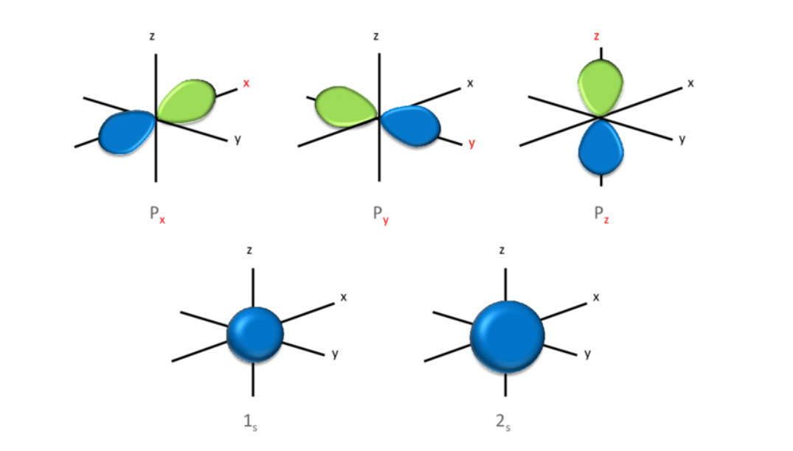

# Chapter 4:  Modern Atomic Theory, Lewis Structures, Ionic Compounds

pages 97 - 125

## Week 7
- Monday - Read pages 97-104 stop before Wait a Minute
- Tuesday - Read pages 104 -109
- Wednesday - Read pages 110 - 114 stop before Ionic Compounds
- Thursday - Class - Lab 4.1, Lab 4.2, and Review Reading

## Notes
- The current model of the atom is called the **quantum mechanical model**. It's similar to the Bohr model except that electrons are treated as waves instead of particles and live in orbitals instead of orbits.
- Photons act like particles in some ways and like waves in other ways. Because they are waves the photon waves can interfere with each other. This is called **constructive interference** when the waves get bigger and **destructive interference** when the waves get smaller.
- You can see the wave interference by shining the light through small openings/slits that are close enough together. Thomas Young studied this in 1801.
- Light also behaves like a particle as in **photoelectric effect** when light is shown on a metal and causes it to emit electrons.
- **orbitals** ([video](https://youtu.be/sMt5Dcex0kg)) are shapes that define an area where the electron lives. They are sometimes called **electron clouds**.
- The **s orbitals** are spherical and the **p orbitals** are shaped like dumbbells.

- s orbitals start at energy level 1 and exist in all the other energy levels. There is only 1 s orbital in each energy level.
- p orbitals start at energy level 2 and exist in all higher levels as well. There are 3 p orbitals in each energy level that has them.
- d orbitals start at energy level 3 and exist in all higher levels as well. There are 5 d orbitals in each energy level that has them.
- there are new orbital shapes at every energy level. Energy level 4 has f orbitals and energy level 5 has g orbitals.
- Each orbital can only hold 2 electrons
- **Wave-particle duality** - [video](https://youtu.be/J1yIApZtLos) - the concept that light as well as many subatomic particals have the properties of both particles and waves.
- **Aufbau principle** - Electrons fill orbitals starting with the lowest-energy ones and then filling higher-energy orbitals as needed.
- Carbon has electrons in the following orbitals: 1s22s22p2 (using **electron configuration** notation)
- 3d orbitals are actually higher energy orbitals than 4s. This means that an electron will fill the 4s before the 3d orbitals.
- **Valence electrons** - an atom's outermost electrons
- The Noble gases are those in column 8A on the periodic table. Their valence electrons are *full*. These can be used to shorten the electron configuration notation by starting from the noble gas that's "smaller" and adding the orbitals that come after it. 
- Elements in the same column of the Periodic Table have similar chemistry.
- Lewis structures ([video](https://youtu.be/y6QZRBIO0-o)) is an easy way to see how close an element is to *full* with regards to its valence electrons.
- *ions* are elements where the number of electrons is NOT the same as the number of protons. If the number of electrons are more than the number of protons then the element will have a negative charge. If the number of elecrons is less than the number of protons, then the element will have a positive charge.
- *anions* are ions with a negative charge. Anions are named with *-ide*. I.e. Sulfide ion written as the element abbrevation and the charge like S2-
- *cations* are ions with a positive charge. Cations are named with the element name as is. I.e. Sodium ion written as the element abbrevation and the charge like Na+
- Most elements are considered metals or non-metals
- Metals have luster, are maleable and tend to conduct electricity. 
- Non-metals are dull, are brittle and don't tend to conduct electricity.
- Some elements are in the middle. We call these **metalloids**

## Examples

CC2. What types of orbitals are available to an electron in the second energy level? How many total orbitals are available to it?
- First, let's list the first few orbitals we know 1s, 2s, 2px, 2py, 2pz, then there are 5 3d orbitals.
- Only 2s, 2px, 2py, 2pz are in the second energy level.
- So, **there are 2 types available s and p**
- And there are exactly **4 orbitals** that are in that energy level

CC3. An electron occupies a d orbital. What is its minimum energy level?
- d orbitals start at **energy level 3**.

CC4. Electron configuration for Oxygen 
- O is in column 6a on the periodic table
- O has 8 protons and thus 8 electrons
- Each orbital can take 2 electrons. 8 / 2 = 4 orbitals
- The first 4 orbitals are 1s, 2s, 2px, 2py
- We can write this as **1s22s22p4**

## Optional Videos

- [Working thru electron configurations](https://youtu.be/8TZ97JLWqMA)
- [Advanced explanation of how election configuration works](https://www.youtube.com/watch?v=2AFPfg0Como)

## Class Videos
 
- [light is a wave](https://youtu.be/Iuv6hY6zsd0)
- [Electrons as waves](https://youtu.be/EOHYT5q5lhQ)
