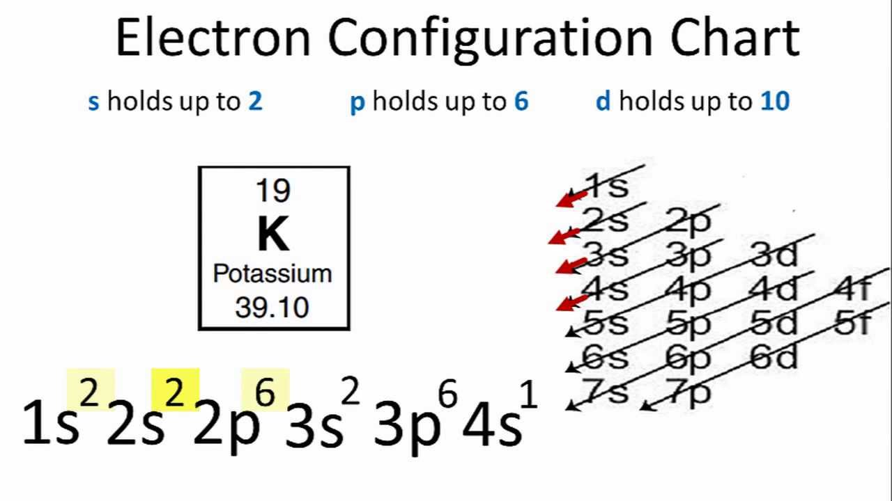

# Chapter 4:  Modern Atomic Theory, Lewis Structures, Ionic Compounds

pages 97 - 125

## Week 7
- Friday - Read pages 114 - 117 stop before Ionic Compounds that don't follow the rules
- Monday - Read pages 117-120
- Tuesday - Study, complete Review pages 124-125, check and correct Review
- Wednesday - CATCH-UP DAY - Study, & Complete Lab Write-ups
- Thursday - Class - - Lab 4.3, Review for Test
- Friday - Chapter 4 Test

## Notes

- In class we went over how to fill the electron configuration with the following chart

- **Ionic compounds** are formed between metals and nonmetals.
- NaCl (salt) is made from sodium, a metal, and clorine, a nonmetal. Metals prefer to lose their outter electrons so Na becomes Na+. Nonmetals prefer to gain electrons so Cl becomes Cl-. Together they are neutral, just NaCl.
- When Na combines with S (Sulfur), Sulfur wants 2 electrons, so it combines with 2 atoms of Na. This forms Na2S.
- The transition metals do not follow the normal rules for ionic compounds
- Copper (Cu) can combine with Cl in 2 different ways to form completely different compounds. 
- We use roman numerals in the names of copper (I) chloride and copper (II) chloride to show how ions combined.
- Ionic compounds split up into their ions when dissolved and those ions move freely in the solution.
- **electrolytes** are chemicals that form a conductive solution when dissolved.
- pure water does NOT conduct electricity, but most water is not pure and does conduct electricity.

## Examples

CC10. Name and chemical formula for aluminum and nitrogen
- Al is a metal in column 3A, so it wants to lose 3 electrons and become Al3+.
- N is a non-metal in column 5A so it wants to gain 3 electrons and become N3-.
- These should combine to form simply **AlN** since the charges have the same number.
- Since nitrogen is the anion, it is renamed nitride.
- The full name would be **Aluminum Nitride**.

CC12. What's the chemical formula for alumninum oxide
- The metal is Al3+ (in column 5A)
- The nonmetal is O2- (in column 6A)
- If we have 2 Al atoms, that gives us 6 electrons that can combine with 3 O atoms to give us a neutral compound
- So the formula is **Al2O3**

## Optional Videos

- [Finding the chemical formula for a compound](https://youtu.be/vscoYh6m46M)
- [Review of the periodic table](https://youtu.be/Zg6KeXsDVwY)
