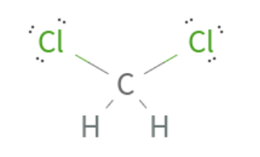
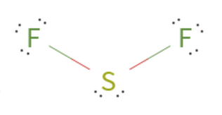

# Chapter 5:  Covalent Compounds, Molecular Geometry

pages 127 - 159

## Week 10

- Friday - Read pages 143 - 147
- Monday - Read pages 148-153
- Tuesday - Study, complete Review pages 159, check and correct Review
- Wednesday - CATCH-UP DAY, Study, & Complete Lab Write-ups
- Thursday - Class - Lab 5.2 and Review for Test
- Friday - Chapter 5 Test 

## Notes

- Lewis structure roles (from video)
  1. Count all the valence electrons in the atoms (count every atom even if its there 3 or 4 times)
  2. Determine the central atom. (probably the one there is only one of or the one with the most unpaired electrons)
  3. Draw single bonds from each other atom to the central atom.
  4. Put all remaining valence electrons on atoms as lone pairs.
  5. Turn lone pairs into double or triple bonds to give every atom an octet (or duet for H).

- **VSEPR** stands for Valence Shell Electron Pair Repulsion. It's a theory for how molecules are shaped. Here is fairly long but good [video on VESPR](https://youtu.be/nxebQZUVvTg) 
- If a molecule has one central atom and four bonded atoms, it will be shaped like a tetrahedron.
- If a molecule has one central atom and three bonded atoms and one unbonded electron pair, it will be shaped like a pyramid.
- If a molecule has one central atom and two bonded atoms and two unbonded electron pairs, it will be shaped like a bent shape.
- If a molecule has one central atom and two double bonded atoms and NO unbonded electron pairs, it will be shaped like straight line.
- If a molecule just has 2 atoms it must be shaped like a straight line.
- If a molecule has one central atom and one double bonded atom and 2 single bonded atoms, it will be shaped like triangle.
- The molecule shapes we are learning about are therefore: tetrahedral, pyramidal, bent, linear, and trigonal.
- A polar covalent molecule MUST HAVE polar covalent bonds. 
- **Purely covalent bond** - A covalent bond in which the electrons are shared equally. Example Cl2 (both atoms are exactly the same so they share equally).
- The shape of molecules and the bonds within the molecules determine whether it is a polor molecule or a non-polar molecule.
- Here is a [video on polar and non-polar molecule shapes](https://youtu.be/uYtwU0uRK7o) that will help you identify which shapes are polar and non-polar. It is a bit long, but the first 5 minutes has most of the information.

## Examples

CC10. What is the shape of CH2Cl2?
- First, we need to figure out the Lewis Structure so we know how it's bonded.
- Using the rules above...
- There are 4 v.e. for C, 1 v.e. for each H, and 7 v.e. for each Cl. That's 4 + 2(1) + 2(7) = 20 valence electrons
- Carbon is the central atom. Each other atom gets a single bond. 
- The remaining valence electrons (20 - 8 bonded = 12 v.e.) go around the 2 Cl atoms - 6 on each.
- C is happy, H's are happy, and Cl's are happy. 

- Now that we have that done, we can see that it makes a **tetrahedral shape** because the central atom has 4 single bonds.

CC11. What is the shape of CO?
- 2 atoms means it is **linear**

CC12. What is the shape of SF2?
- S has 6 v.e. and each F has 7 v.e. - that's 6 + 2(7) = 20.
- S will make 2 single bonds with the F atoms. S will get 4 unbonded electrons and each F will get 6 unbonded electrons.

- one central atom with 2 single bonds and 2 electron pairs will make a **bent** shape

CC13. Is ammonia NH3 polar or non-polar?
- If you do the lewis structure, you will see that there are 3 single bonds and 1 lone pair of electrons on N. 
- That means the shape is pyrimidal. 
- N has a higher electronegativity than H and so will pull harder on the electrons. So there are polar covalent bonds.
- Since there are polar covalent bonds and the shape is pyramidal (doesn't have an H on every side), **the molecule is polar**

## Optional videos

- short video on [the polarity of water](https://youtu.be/ASLUY2U1M-8)

## Class videos
- [how soap works](https://www.youtube.com/watch?v=ZOKAoNbJkSg)
- [chemical bond song](https://www.youtube.com/watch?v=wWUYHHo-zB0)
- [molecular shapes rap](https://www.youtube.com/watch?v=ZCctlT0cayU)
