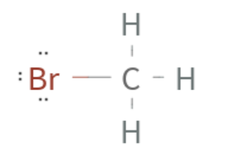
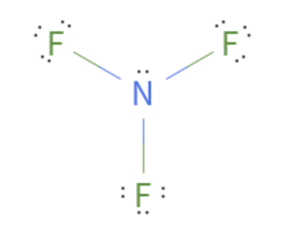

# Chapter 5:  Covalent Compounds, Molecular Geometry

pages 127 - 159

## Week 9

- Monday - Read pages 127 - 131 stop before More complicated Lewis Structures
- Tuesday - Read pages 131-135
- Wednesday - Read pages 136 -142
- Thursday - Class - Lab 5.1, and Review Reading

## Notes

- [Online tool to get lewis structures](https://www.wolframalpha.com/widgets/view.jsp?id=c11e9ad0ab00998884f0733c8f62c07d)
- **Covalent bond** - A chemical bond that is made by sharing electrons.
- In Lewis dot diagrams, covalent bonds are written as lines.
- **Homonuclear diatomic** - a molecule consisting of two atoms of the same element. Ex. Cl2
- Remember the following Homonuclear diatomic molecules: **H, N, O, F, Cl, Br, I**
- Hydrogen's ideal electron configuration consists of 2 valence electrons (not 8)
- Reminder: compounds consist of more than one element (Br2 is not a compound)
- **Covalent compound** - A compound whose elements are held together with covalent bonds. These DO NOT contain metals.
- Covalent bonds can come in single, double, triple, or even quadruple bonds. We write these with the same number of lines. A single bond has 1 line, a double bond has 2 lines, etc.
- We use double bonds when atoms share 2 electrons instead of just one. When drawing the Lewis structure, look for extra electron pairs to make these double or even triple bonds.
- Reminder ionic compounds form between metals and non-metals and the names are very systematic. The metal comes first and its name is unchanged, the non-metal comes second and has the suffix "ide" added. You may also need a roman numeral if there are different ionic compounds made from the same metal/non-metal combination (but this is rare).
- Naming covalent compounds is complicated because they don't conbine in a "normal" way each time. The same elements may combine in many different ways. So, we use the name to specify how many of each element are in the chemical formula.
- You should know the following prefixes: mono, di, tri, tetra, penta, and hexa. (1, 2, 3, 4, 5, and 6)
- The only time the prefix is omitted is if the first element in the name would have "mono". So, if there is no prefix on the first element in the name, it has 1 atom in the formula.
- The text book didn't mention which element to list first when naming or writing the chemical formula. I found this on the internet which seems correct: "You also need to know which element to put first in the formulas and names of these compounds. Generally, they are in the same left-to-right order that they are on the periodic table, except that you would have to squeeze hydrogen in between nitrogen and oxygen."
- **Atomic radius** - The distance from the center of the nucleus to the atom's valence electrons. As you travel up the Periodic Table and to the right, the atomic radius decreases.
- **Electromagnetivity** - A measure of how strongly atoms attract electrons in a covalent bond. As you travel up the Periodic Table and to the right, electromagnetivity increases. These numbers tell us how strongly the atom will pull on electrons. The higher the number, the stronger the pull.
- **Polar covalent bonds** - A covalent bond in which the electrons are not shared equally.
- **Polar covalent molecule** - A molecule that has an uneven distribution of electrons resulting in slight charges within the molecule itself. For example, a water molecule has a more negative charge near the oxygen and more positive charge near the hydrogens.
- A polar covalent molecule MUST HAVE polar covalent bonds.
-**Purely covalent bond** - A covalent bond in which the electrons are shared equally. Example Cl2 (both atoms are exactly the same so they share equally).

## Examples

CC1. Lewis structure for Bromine (as it exists in nature)
- First, I need to remember that Bromine is one of the homonuclear diatomic molecules, which means it combines with itself. So, there are 2 atoms of Bromine in each molecule.
- The symbol for Bromine is **Br**
- If I write the lewis dot structure for Br it has 7 valence electrons, because it is in column 7A. I will draw 2 of them together since there are 2 atoms in the molecule.
- If they each contribute 1 electron to share, they will each have 8 valence electrons some of the time. Since this is a covalent bond (sharing electrons), I will draw a line instead of the shared electrons. 
	 

CC2. Lewis structures for HCl, CH3Br
1. One atom of each H and Cl, Cl has 7 valence electrons because it is in Column 7A. Thus it has 7 dots. H has 1 dot. This is a covalent bond because there are no metals, so the bond is written with a line. Don't forget to keep the other 6 dots around the Cl that are not being shared.

	 

2. One atom of C, 3 of H, and 1 of Br. C has 4 dots because it is in column 4A, each H has 1 dot. Br has 7 dots because it is in column 7A. We put C in the middle since it has the most missing dots. We can easily pair each side of the C with the 2 H's and the one Br. These are covalent bonds because there are no metals. Thus the bonds are written with lines. Don't forget to keep the other 6 dots around the Br that are not being shared.

	 

CC3. What's the lewis structure for CO and CO2?
- C has 4 dots and O has 6 dots based on their columns in the Periodic table. This one is a bit hard because the number of shared electrons isn't obvious. Carbon wants to share 4 electrons, but Oxygen only needs to share 2. Since both elements want to have 8 valence electrons, Oxygen ends up sharing more than it wants to. So, then we up with a triple bond between the C and O. The lewis structure would have a C with 2 dots connected with 3 lines to the O that would have 2 dots. In this case, the Oxygen has shared an entire pair of electrons to make the Carbon happy.

	 

CC4. What's the name of CCl4
- C is Carbon. There is one atom of carbon, but it's first and so we leave off the prefix mono.
- Cl is Chlorine. There is 4 atoms of chlorine, so we use the prefix tetra.
- **Carbon TetraChlorine**

CC5. What's the chemical formula of silicon monoxide?
- Silicon is Si. There must be only 1 atom because there isn't any prefix.
- Oxygen is O. There is 1 based on the prefix mono.
- **SiO**

CC8. Lewis structure for NF3?
- N is in column 5A so it has 5 dots. F is in column 7A so it has 7 dots.
- To make N happy it needs to share 3 covalent bonds. One with each F. We will draw lines for the bonds.
- That leaves 2 dots on the N and 6 dots on each F.
- Looking at the periodic table, I can see that C and F are in the same row, but F is farther to the right. That means it should have more pull. You can confirm this by looking at the chart on page 138 as well. So, each F will pull the electrons in the bond closer to it making them slightly more negative and leaving the N slightly more positive. 

	 

## Optional videos

## Class videos
